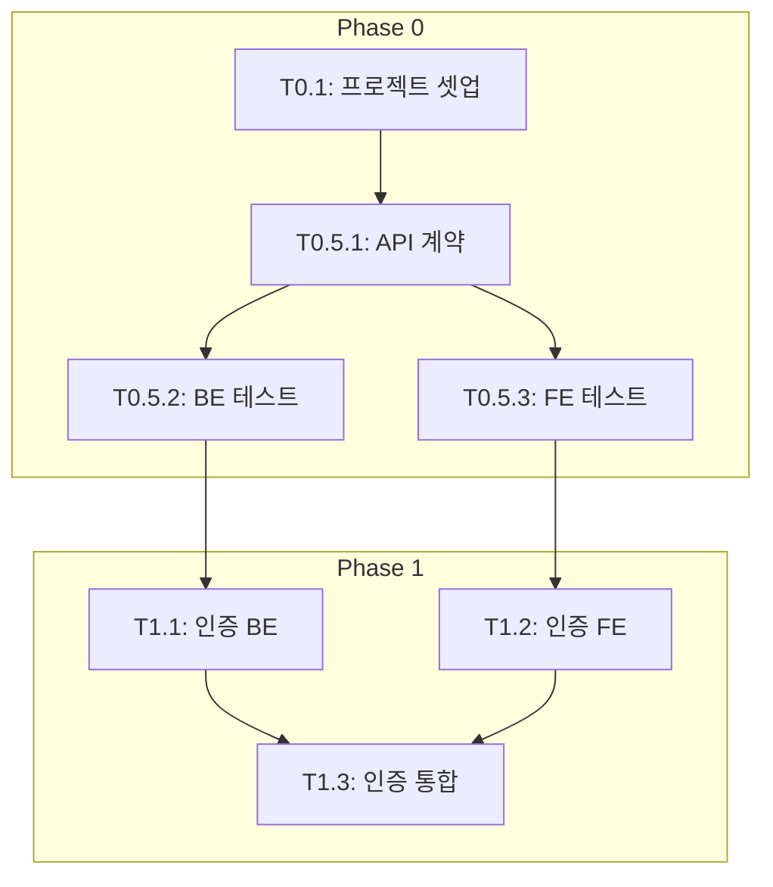

# Phase 4: TASKS.md 생성 가이드

Phase 1-3 완료 후 AI 에이전트가 사용할 태스크 목록(TASKS.md)을 생성합니다.

---

## 개요

TASKS.md는 **AI 에이전트(오케스트레이터 + 서브에이전트)가 참조하는 작업 명세서**입니다.

- 오케스트레이터: 전체 태스크 흐름 파악, 서브에이전트 호출
- 서브에이전트: 개별 태스크 실행, TDD 사이클 수행

---

## 워크플로우

### 1단계: 기획 문서 읽기

다음 파일들을 순서대로 읽습니다:

```
docs/planning/
├── 01-prd.md           # 제품 요구사항 → 기능 목록 추출
├── 02-trd.md           # 기술 요구사항 → 기술 스택 확인
├── 03-user-flow.md     # 사용자 흐름 → 마일스톤 구조화
├── 04-database-design.md # DB 설계 → DB 태스크 추출
└── 05-design-system.md # 디자인 시스템 → UI 태스크 참고
```

### 2단계: 규칙 파일 읽기

**필수!** TASKS 생성 전에 반드시 읽습니다:

```
references/phase4-tasks/tasks-rules.md
```

### 3단계: TASKS.md 생성

규칙을 적용하여 `docs/planning/06-tasks.md` 생성

---

## 핵심 규칙 요약

### Phase 번호 규칙

| Phase | Git Worktree | 설명 |
|-------|-------------|------|
| Phase 0 | 불필요 | main 브랜치에서 직접 작업 |
| Phase 1+ | **필수** | 별도 worktree에서 작업 |

### TDD 워크플로우

```
Phase 1+ 태스크는 반드시:
1. RED: 테스트 먼저 작성 (실패 확인)
2. GREEN: 최소 구현 (테스트 통과)
3. REFACTOR: 리팩토링 (테스트 유지)
```

### Quality Gate

```
병합 전 필수 통과:
[ ] 빌드 성공
[ ] 테스트 통과
[ ] 린트 통과
[ ] 타입 체크 통과
[ ] 커버리지 >= 80%
```

### 태스크 독립성

```
각 태스크는 독립적으로 실행 가능해야 함:
- 의존성이 있으면 Mock 설정 포함
- 병렬 실행 가능 여부 명시
```

---

## 마일스톤 구조

PRD와 User Flow를 기반으로 마일스톤을 구성합니다:

| 마일스톤 | 내용 | Phase |
|----------|------|-------|
| **M0** | 프로젝트 셋업 | Phase 0 |
| **M0.5** | 계약 & 테스트 설계 | Phase 0 |
| **M1** | FEAT-0 (인증/공통) | Phase 1 |
| **M2** | FEAT-1 (핵심 기능) | Phase 2 |
| **M3** | FEAT-2 (부가 기능) | Phase 3 |

### M0: 프로젝트 셋업 (Phase 0)

- T0.1: 프로젝트 구조 생성
- T0.2: 의존성 설치 및 설정
- T0.3: Docker 환경 구성
- T0.4: CI/CD 파이프라인 설정

### M0.5: 계약 & 테스트 (Phase 0)

- T0.5.1: API 계약 정의 (OpenAPI)
- T0.5.2: 백엔드 테스트 작성 (RED)
- T0.5.3: 프론트엔드 테스트 작성 (RED)

### M1+: 기능 구현 (Phase 1+)

- T{N}.1: 백엔드 구현 (RED→GREEN)
- T{N}.2: 프론트엔드 구현 (RED→GREEN)
- T{N}.3: 통합 테스트 (E2E)

---

## PRD → TASKS 변환 예시

### PRD의 기능 목록

```markdown
## 핵심 기능

### FEAT-0: 인증
- 이메일 로그인/회원가입
- 소셜 로그인 (Google)
- 프로필 관리

### FEAT-1: 거래 기록
- 수입/지출 입력
- 거래 목록 조회
- 거래 상세 보기
```

### 변환된 TASKS.md

```markdown
## M1: FEAT-0 인증

### [] Phase 1, T1.1: 인증 API 구현 RED→GREEN
**담당**: backend-specialist
**테스트**: tests/api/test_auth.py
**구현**: app/api/routes/auth.py
...

### [] Phase 1, T1.2: 인증 UI 구현 RED→GREEN
**담당**: frontend-specialist
**테스트**: src/__tests__/auth/
**구현**: src/pages/Login.tsx
...

### [] Phase 1, T1.3: 인증 통합 테스트
**담당**: test-specialist
**테스트**: e2e/auth.spec.ts
...

---

## M2: FEAT-1 거래 기록

### [] Phase 2, T2.1: 거래 API 구현 RED→GREEN
...

### [] Phase 2, T2.2: 거래 UI 구현 RED→GREEN
...
```

---

## 의존성 그래프 작성

Mermaid flowchart로 태스크 간 의존성을 시각화합니다:



---

## 병렬 실행 가능 태스크 명시

BE/FE가 독립적인 경우 병렬 실행 가능:

| Phase | 병렬 가능 | 이유 |
|-------|----------|------|
| Phase 1 | T1.1 (BE), T1.2 (FE) | API 계약 기반 독립 개발 |
| Phase 2 | T2.1 (BE), T2.2 (FE) | Mock 사용으로 독립 개발 |

---

## 완료 후 안내

TASKS.md 생성 완료 후 사용자에게 안내:

```
TASKS.md 생성이 완료되었습니다!

생성된 파일: docs/planning/06-tasks.md

다음 단계:
1. TASKS.md 내용 검토
2. /orchestrate 명령으로 개발 시작
3. 각 태스크를 TDD 사이클로 구현

개발 시작하시겠습니까?
```
